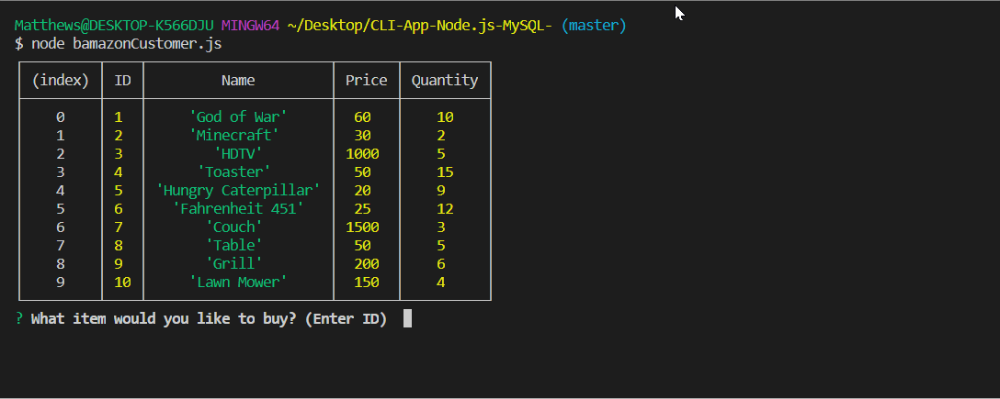
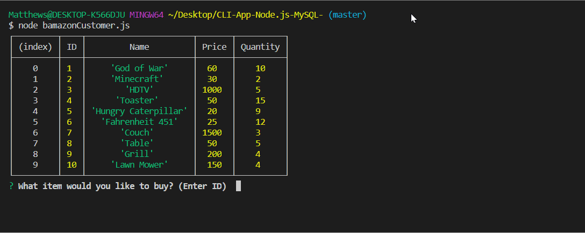
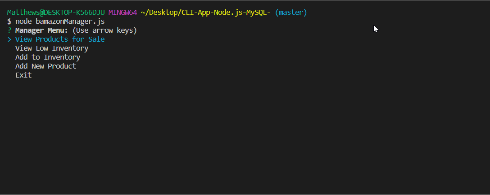

# CLI-App-Node.js-MySQL-

### Description
This is a mock amazon marketplace which stores the items in a MySQL database. The database is updated with every customer and manager request.

#### Customer

The customer could:

- Buy items:

- But their purchase can't exceed the stock quantity.

#### Manager

The manager could:

- View current inventory:

- View items which have a stock quantity of 5 or less:

- Add more stock quantity to any item:

- Add a new item:

